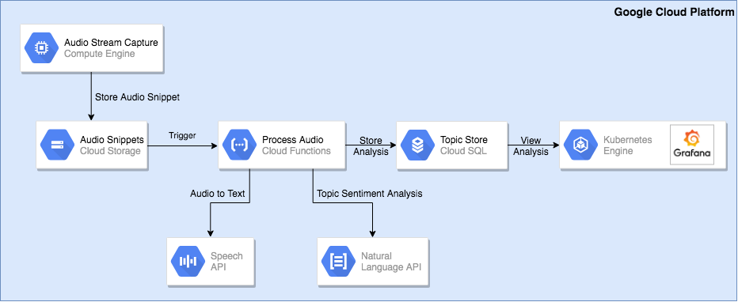
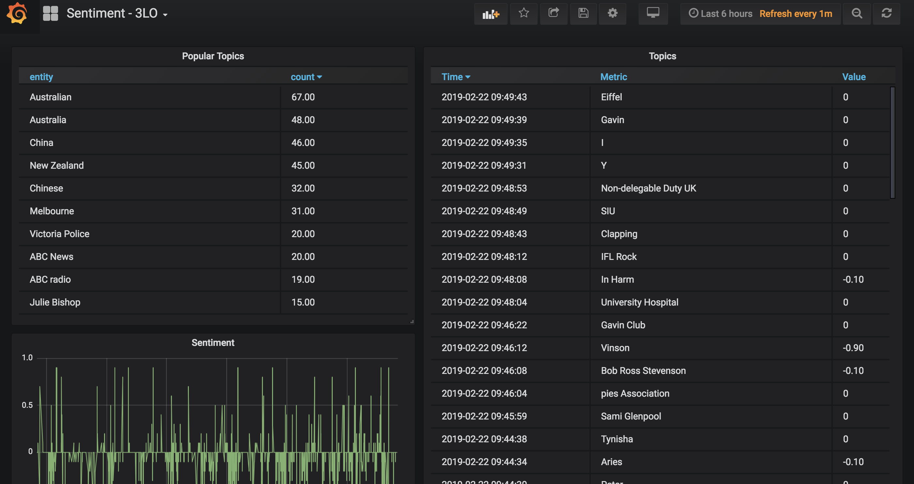

# ml-demo3

This repo contains the code for the Kasna/Eliiza Google ML Specialisation, demo 3.
Code Repo: https://github.com/kasna-cloud/ml-demo3

## 2. Use-Case

### Background

The City of Melbourne regularly monitors media channels to understand how the general public is responding to marketing campaigns and news related to the City in Melbourne in general. Automatic monitoring of social media and online news is being managed by an existing solution, but the monitoring of broadcast radio, especially talk-back radio, is manual and ad-hoc. 

### Solution Overview 

Eliiza has developed a solution for The City of Melbourne to automatically monitor broadcast radio. This solution provides summary reports of most discussed daily and weekly topics across the various talk-back channels as well as the sentiment associated with each topic scored from -1 (negative) through to 1 (positive) with neutral sentiment at 0. Additionally, alerts are able to configured to notify the PR function within the City of Melbourne when specific topics are being discussed within a few minutes of them occurring. This provides the organistion with the ability review the audio of what was being discussed and to quickly respond to topics as they are being discussed live on-air. 

### Solution Detail

The technical solution makes use of the Google Cloud AI Services, Speech API and Natural Language API. The diagram below shows the overall system architecture. 

* **Audio Stream Capture** - A Compute Engine instance which runs a process to capture each audio stream and delivers audio in snippets (currently 60 second pieces of audio) into the Cloud Storage location
* **Audio Snippets** - Raw audio snippets that can been stored in .flac format so they are ready to be processed
* **Process Audio** - A Cloud Function that is triggered from events in Cloud Storage. When a new audio snippet is stored in Cloud Storage the function converts that audio to text using the Google Speech API. The text response is then passed to the Natural Language API to extract conversation topics and their associated sentiment. These topic/sentiment pairs are then stored in the Topic Store along with the timestamp they occurred and the audio channel they were sourced from. 
* **Topic Store** - A Cloud SQL MySQL instance that acts as a time-series store of topic/sentiment events per audio channel
* **Grafana** - A dashboard tool running on Google Kubernetes Engine that is able to provide various flexible data visualisations and alerting on time-series data. In this instance it is being used to display real-time topics being discussed, the top 10 topics, and their associated sentiments, all within a time-window selected by the end-user

### Audio Capture Process

The Audio Capture Process makes use of the `ffmpeg` command line tool to be able to capture audio streams and store regular audio snippets in the `.flac` format appropriate for Google Speech API. 

The sample command below is what is used to capture the ABC 3LO radio live-stream. It firstly segments the audio into 60 second seconds and stores it as a `.flac` file with a timestamp filename. Additional it stores hourly snippets in `mp3` format. The smaller snippets are to be processed and discarded, while the longer `mp3` files are retained to enable later review of the audio at a point in time to help understand the context of a topic being discussed. 

The files are stored in Cloud Storage through the use of the `Cloud Storage FUSE` which supports mounting of Cloud storage buckets as file systems.  

`ffmpeg -i http://live-radio01.mediahubaustralia.com/3LRW/mp3/ -c:a flac -f segment -segment_time 60 -s
trftime 1 "3LO/%Y-%m-%d_%H-%M-%S.flac" -c:a mp3 -f segment -segment_time 3600 -strftime 1 "3LO-long/%Y-%m-%d_%H-%M-
%S.mp3"`

### Topic Dashboard

The image below shows the dashboard running live against ABC Radio 3LO from the last 6 hours and refreshing every minute. The list on the right contains the topics in real-time along with their associated sentiment. The list on the left aggregates the topics over the viewed period and shows the top ten. During this particular morning of talk-back radio China and New Zealand were discussed in detail. The graph below gives a simple overall feel that the sentiment of topics is generally more negative than positive (as you would expect of talk-back radio). 

## 3. Success Criteria
### 3.3.1 Code
#### 3.3.1.1 Code Repository

Code Repo: https://github.com/kasna-cloud/ml-demo3

#### 3.3.1.2 Code origin certification
Kasna verifies that all code is original and developed within the partner organization.

### 3.3.2 Data
#### 3.3.2.1 Dataset in GCP
Partners must describe the dataset being used for demo #3 and provide documentation of where within GCP the data of demo #3 is stored (for access by the ML models during training, testing, and in production, as appropriate).

*Evidence* must include the Project Name and Project ID for the GCP storage where the dataset (for demo #3) resides, and a description of the independent features and outcome variables of interest within the dataset.

### 3.3.3 Whitepaper/Blog post
#### 3.3.3.1 Business Goal and ML Solution
Partners must describe:
* The business question/goal being addressed.
* The ML use case.
* How ML solution is expected to address the business question/goal?

*Evidence* must include (in the Whitepaper) a top-line description of the business question/goal being addressed in this demo, and how the proposed ML solution will address this business goal.

#### 3.3.3.2 Data Exploration
Partners must describe the following:
* How and what type of data exploration was performed?
* What modeling decisions were influenced by data exploration?

*Evidence* must include a description (in the Whitepaper) of the tools used and the type of data exploration performed, along with code snippets (that accomplish the data exploration). Additionally, the whitepaper must describe how decisions regarding the use of pre-trained ML APIs or AutoML were influenced by data exploration.

#### 3.3.3.3 Feature Engineering
Partners must describe the following:
* If and what kind of feature engineering was performed?
* What features were selected for use in the ML model and why?

*Evidence* must include a description (in the Whitepaper) of the feature engineering performed (and rationale for the same), what original and engineered features were selected for incorporation as independent predictors in the ML model, and why. Evidence must include code snippets detailing the feature engineering and feature selection steps.

#### 3.3.3.4 Preprocessing and the data pipeline
The partner must describe the data preprocessing pipeline, and how this is accomplished via a package/function that is a callable API (that is ultimately accessed by the served, production model).

*Evidence* must include a description (in the Whitepaper) of how data preprocessing is accomplished, along with the code snippet that accomplishes data preprocessing as a callable API.

#### 3.3.3.5 ML Model Desgin(s) and Selection
Partners must describe either of the following:
* Which pre-trained ML API was chosen demo #3, and why?
 or
* Which AutoML product was chosen for demo #3?

*Evidence* must describe (in the Whitepaper) selection criteria implemented, as well as the specific ML model algorithms that were selected for training or evaluation purposes (as appropriate). Code snippets detailing the incorporation of the pre-trained ML APIs or the AutoML product into the ML model solution for demo #3 must be enumerated.

#### 3.3.3.6 ML model training and development
If the partner implements pre-trained APIs, this control can be skipped.

If the partner is using AutoML, the following must be described:
* Dataset sampling used for model training (and for dev/test independent datasets) and justification of sampling methods.
* Implementation of AutoML based model training.
* The model evaluation metric that is implemented, and a discussion of why the implemented metric is optimal given the business question/goal being addressed.

*Evidence* must describe (in the Whitepaper) each of the above ML model training and development bullet points (if AutoML is implemented in demo #3). In addition, code snippets that accomplish each of these tasks need to be enumerated.

#### 3.3.3.7 ML Model Evaluation
Partners must describe how the ML model, whether implemented using pre-trained ML APIs or via AutoML, performs on an independent test dataset.

*Evidence* must include records/data (in the Whitepaper) of how the ML model developed and selected to address the business question performed on an independent test dataset that reflects the distribution of data that the ML model is expected to encounter in a production environment. In addition, code snippets on model testing need to be enumerated.

### 3.3.4 Proof of Deployment
#### 3.3.4.1 Model application on GCP 
Partners must provide proof that the ML model/application is deployed and served on GCP.

*Evidence* must include the Project Name and Project ID of the deployed ML model.

#### 3.3.4.2 Callable library/application
Partners must demonstrate that the ML model for demo #3 is a callable library and/or application.

*Evidence* must include a demonstration of how the served model can be used to make a prediction via an API call.

#### 3.3.4.3 Editable model/application
Partners must demonstrate the deployed ML model, if using any AutoML product, is customizable.

*Evidence* must include a demonstration that the deployed model, if using any AutoML product, is fully functional after an appropriate code modification, as might be performed by a customer.

