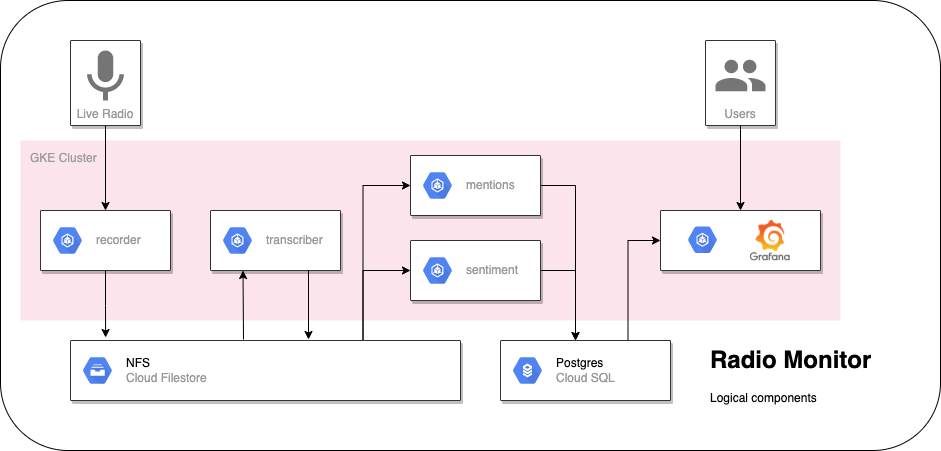
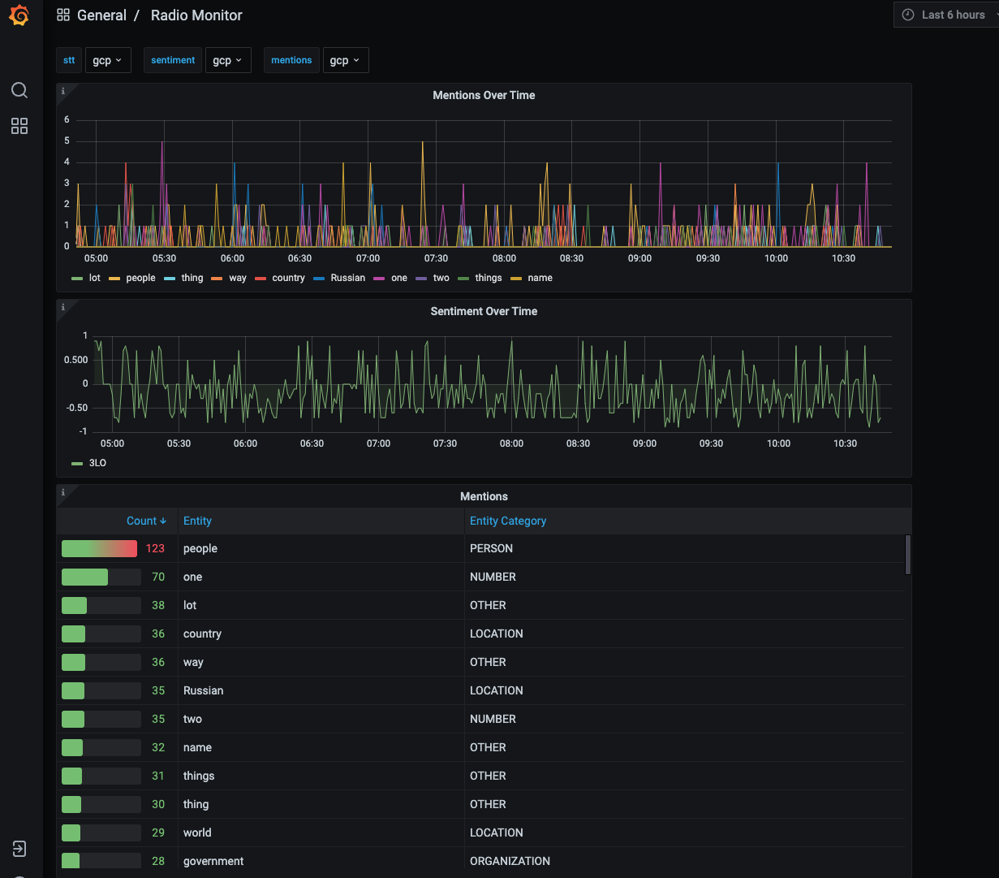

# ml-demo3

This repo contains the code for the Kasna/Eliiza Google ML Specialisation, demo 3.
Code Repo: https://github.com/kasna-cloud/ml-demo3

# Use-Case

The City of Melbourne regularly monitors media channels to understand how the general public is responding to marketing campaigns and news related to the City in Melbourne in general. Automatic monitoring of social media and online news is being managed by an existing solution, but the monitoring of broadcast radio, especially talk-back radio, is manual and ad-hoc. 

# Solution 

## Overview

Eliiza (Mantel Group) has developed a solution for The City of Melbourne to automatically monitor broadcast radio. This solution provides summary reports of most discussed daily and weekly topics across the various talk-back channels as well as the sentiment associated with each topic scored from -1 (negative) through to 1 (positive) with neutral sentiment at 0. Additionally, alerts are able to configured to notify the PR function within the City of Melbourne when specific topics are being discussed within a few minutes of them occurring. This provides the organistion with the ability review the audio of what was being discussed and to quickly respond to topics as they are being discussed live on-air. 

The technical solution makes use of the Google Cloud AI Services, Speech API and Natural Language API. The diagram below shows the overall system architecture. 

* **Stream Recorder** - A GKE container runs a capture process to ingest each audio stream from a radio station source and delivers audio in snippets (currently 60 second pieces of audio) into local pod storage 
* **Audio Decoder** - The same GKE container monitors for written segments and processes them with the `ffmpeg` audo processing tool. The output of this process then writes the resultant file to a GKE attached GCP Filestore NFS share. 
* **Transcriber** - Another GKE container monitors files within the NFS share. When a new audio snippet is detected, it is converted to text using the Google Speech-to-text API. The resultant segment transcription is then saved back to the NFS share.
* **Mentions** - A GKE container scans the NFS share for new transcriptions and response is then passed to the Natural Language API to extract conversation "mentions". These mentions are then stored in the Topic Store along with the timestamp they occurred and the audio channel they were sourced from into a Cloud SQL database table. 
* **Sentiment** - A GKE container does the same as the "Mentions" container but processes the transcript for speaker sentiment. The results are then processed and written into the Cloud SQL database.
* **Grafana** - A dashboard tool running on Google Kubernetes Engine that is able to provide various flexible data visualisations and alerting on time-series data. In this instance it is being used to display real-time topics being discussed, the top 10 topics, and their associated sentiments, all within a time-window selected by the end-user

### Pre-processing 

The Audio Capture Process makes use of the `ffmpeg` command line tool to be able to capture audio streams and store regular audio snippets in the `.flac` format appropriate for Google Speech API. 

The sample command below is what is used to capture the ABC 3LO radio live-stream. It firstly segments the audio into 60 second seconds and stores it as a `.flac` file with a timestamp filename. Additional it stores hourly snippets in `mp3` format. The smaller snippets are to be processed and discarded, while the longer `mp3` files are retained to enable later review of the audio at a point in time to help understand the context of a topic being discussed. 

The files are stored in GCP Filestore NFS share.

`ffmpeg -i http://live-radio01.mediahubaustralia.com/3LRW/mp3/ -c:a flac -f segment -segment_time 60 -s
trftime 1 "3LO/%Y-%m-%d_%H-%M-%S.flac" -c:a mp3 -f segment -segment_time 3600 -strftime 1 "3LO-long/%Y-%m-%d_%H-%M-
%S.mp3"`

### Processors

#### Speech-to-text

#### Language Sentiment

#### Mentions

#### Natural Language

### Storage 

### Infrastructure 

#### GCP

#### GKE

####

### Visualisation 

The image below shows the dashboard running live against ABC Radio 3LO from the last 6 hours and refreshing every minute. The list on the right contains the topics in real-time along with their associated sentiment. The list on the left aggregates the topics over the viewed period and shows the top ten. During this particular morning of talk-back radio China and New Zealand were discussed in detail. The graph below gives a simple overall feel that the sentiment of topics is generally more negative than positive (as you would expect of talk-back radio). 

### Build and Deploy

